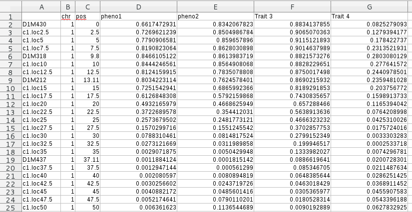

Prepare your data
=================

In order to run correctly MQ², you may have to prepare a little bit you
data.

Running from MapQTL output
~~~~~~~~~~~~~~~~~~~~~~~~~~

For each project, `MapQTL <http://www.kyazma.nl/index.php/mc.MapQTL>`_
generates a ``.mqp`` file containing information about the project.
Within the same folder, MapQTL generates a folder
that contains all QTL mapping results. The results folder has the same
name as the project and ends with the extension: ``.mpd``.

To prepare the QTL mapping data for MQ:
- locate the ``.mpd`` folder
- create a zip archive of this folder

Only the files with the extension `.mqo` are required, however, the
presence of other files does not affect the results.

Running from R/qtl output
~~~~~~~~~~~~~~~~~~~~~~~~~

MQ² can be used on data generated using `R/qtl <http://www.rqtl.org/>`_.
This data has to be provided in a CSV file or an Excel document.

Example R code to generate a MQ² compatible output file from R/qtl ::

  library(qtl)
  data(fake.bc)

  # Perform the QTL mapping analysis
  fake.bc <- calc.genoprob(fake.bc, step=2.5)
  qtl_out <- scanone(fake.bc, pheno.col=c(1:length(fake.bc$pheno)))

  write.csv(qtl_out, file='rqtl_out.csv')

See :ref:`other_tool` for more explanations about the format.

.. _other_tool:

Running from other QTL mapping tools
~~~~~~~~~~~~~~~~~~~~~~~~~~~~~~~~~~~~

MQ² can be run on data from any QTL mapping tool according the data can
be transformed to a Comma Separated Value (CSV) file (using commas ``,``
as delimiter) or in an Excel document.

The format of the input is very important for MQ² to work. The CSV or
Excel sheet should be formatted as follow:

- 1st column contains the markers
- 2nd column contains the linkage groups
- 3rd column contains the position of these markers
- 4th and following columns contain the trait data: the LOD value
  associated to each marker for this trait.

The first row of the document contains the headers
(Markers, Linkage Group, position, Trait name1, Trait name2, etc).

The screenshot below presents how the data should be formated:

   Structure the CSV file and Excel documents should have to be processed
   by MQ².

The CSV or Excel document should be compressed into a .zip archive to be
uploaded on the web-interface. 

.. note:: MQ² can only analyze one CSV file or one Excel document at a time,
          however, the Excel document may contain multiple sheets.

